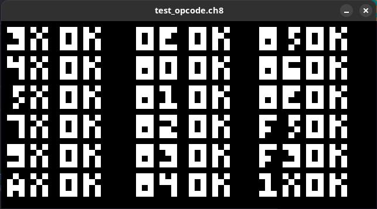

# CHIP-8 Emulator (or Interpreter)

[corax89’s chip8-test-rom](https://github.com/corax89/chip8-test-rom)

# To Do

- [ ] Add beep audio
- [ ] Run in browser
- [ ] Add configuration file to change color and keypad
- [ ] Add SUPER-CHIP support
- [ ] Add XO-CHIP support

# Credits

This is a list of useful resources that I consulted for build this project.

- Thomas P. Greene: [Cowgod's Chip-8 Technical Reference v1.0](http://devernay.free.fr/hacks/chip8/C8TECH10.HTM#2.4)

- Tobias V. Langhoff: [Guide to making a CHIP-8 emulator](https://tobiasvl.github.io/blog/write-a-chip-8-emulator/#what-next)

- h4ck3rk3y: [go-8](https://github.com/h4ck3rk3y/go-8/tree/master)
