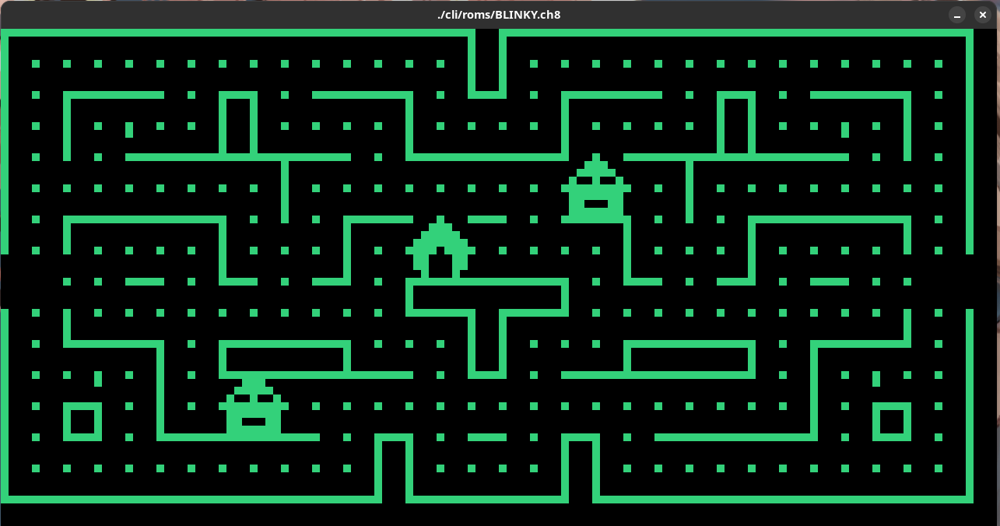
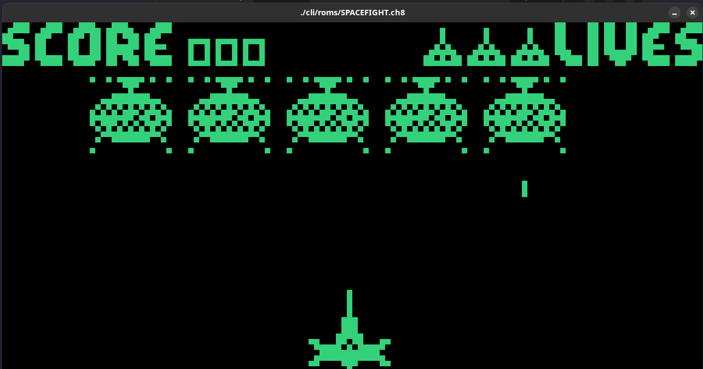
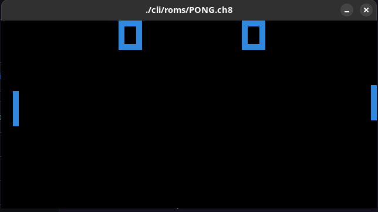
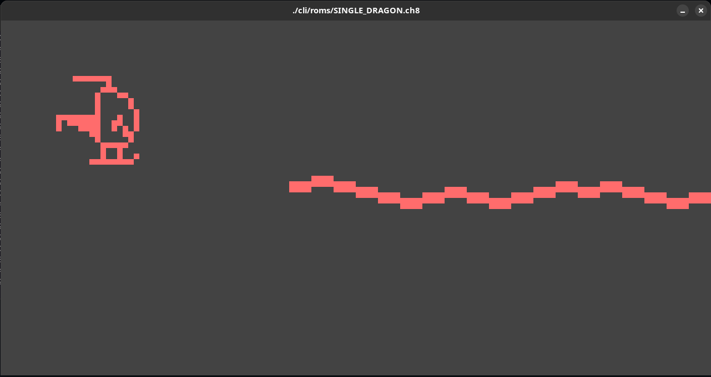

# CHIP-8 Emulator (or Interpreter)

A CHIP-8 Emulator project to put GoLang in practice and learn how an emulator works.

**Blinky [Hans Christian Egeberg, 1991]** | **Spacefight 2091 [Carsten Soerensen, 1992]**
:-------------------------:|:-------------------------:
  |  

**Pong** | **Single Dragon (Bomber Section) [David Nurser, 1993]**
:-------------------------:|:-------------------------:
  |  

# Demo

Chip-8 browser demo available in the following link:

[CHIP-8 emulator demo](https://gaoliveira21.github.io/chip-8/)

# Keypad Configuration

| Your keyboard | Chip 8 |
|---------------|--------|
| 1             | 1      |
| 2             | 2      |
| 3             | 3      |
| 4             | C      |
| Q             | 4      |
| W             | 5      |
| E             | 6      |
| R             | D      |
| A             | 7      |
| S             | 8      |
| D             | 9      |
| F             | E      |
| Z             | A      |
| X             | 0      |
| C             | B      |
| V             | F      |

# References

This is a list of useful resources that I've consulted for build this project.

- Thomas P. Greene: [Cowgod's Chip-8 Technical Reference v1.0](http://devernay.free.fr/hacks/chip8/C8TECH10.HTM#2.4)

- Tobias V. Langhoff: [Guide to making a CHIP-8 emulator](https://tobiasvl.github.io/blog/write-a-chip-8-emulator)

- h4ck3rk3y: [go-8](https://github.com/h4ck3rk3y/go-8/tree/master)

-  cassianoperin: [CHIP8_GO ](https://github.com/cassianoperin/CHIP8_GO)

- Octo: [Mastering SuperChip](http://johnearnest.github.io/Octo/docs/SuperChip.html)

- corax89: [chip8-test-rom](https://github.com/corax89/chip8-test-rom)

- Timendus: [chip-8 test suite](https://github.com/Timendus/chip8-test-suite)
