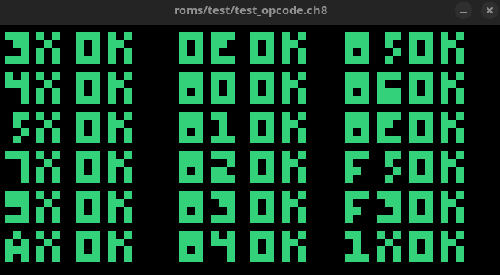

# CHIP-8 Emulator (or Interpreter)

A CHIP-8 Emulator project to put GoLang in practice and learn how an emulator works.

[corax89’s chip8-test-rom](https://github.com/corax89/chip8-test-rom)
[Timendus' chip-8 test suite](https://github.com/Timendus/chip8-test-suite)

# Demo

Chip-8 browser demo available in the following link:

[CHIP-8 emulator demo](https://gaoliveira21.github.io/chip-8/)

# Keypad Configuration

[Your keyboard] --> [Chip 8]

- 1 --> 1
- 2 --> 2
- 3 --> 3
- 4 --> C
- Q --> 4
- W --> 5
- E --> 6
- R --> D
- A --> 7
- S --> 8
- D --> 9
- F --> E
- Z --> A
- X --> 0
- C --> B
- V --> F

# To Do

- [X] Add beep audio
- [X] Run in browser
  - [ ] Audio support
  - [X] Select ROM
- [ ] Add configuration file to change color and keypad
- [ ] Improve unit tests
- [ ] Add SUPER-CHIP support
- [ ] Add XO-CHIP support

# References

This is a list of useful resources that I consulted for build this project.

- Thomas P. Greene: [Cowgod's Chip-8 Technical Reference v1.0](http://devernay.free.fr/hacks/chip8/C8TECH10.HTM#2.4)

- Tobias V. Langhoff: [Guide to making a CHIP-8 emulator](https://tobiasvl.github.io/blog/write-a-chip-8-emulator)

- h4ck3rk3y: [go-8](https://github.com/h4ck3rk3y/go-8/tree/master)

-  cassianoperin: [CHIP8_GO ](https://github.com/cassianoperin/CHIP8_GO)

- Octo: [Mastering SuperChip](http://johnearnest.github.io/Octo/docs/SuperChip.html)
